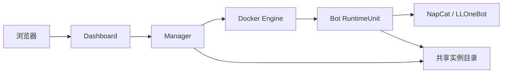
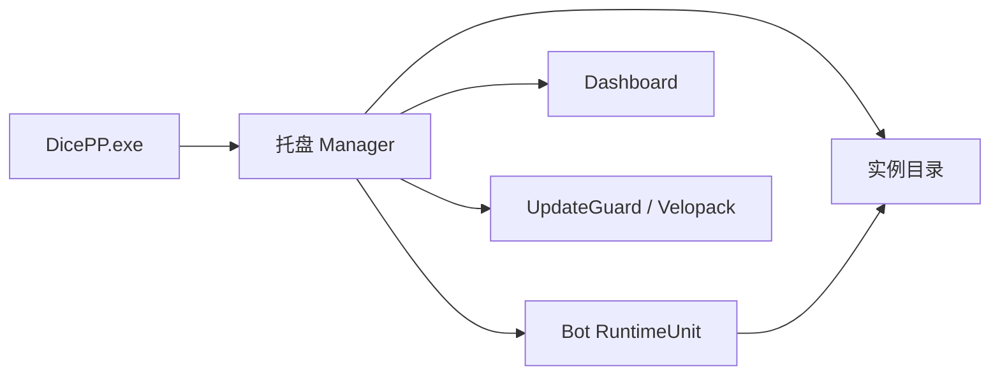
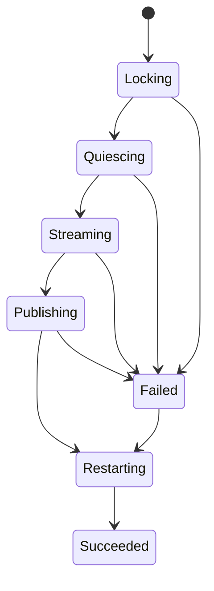

# Manager、归档恢复与自动升级架构

> 状态：目标架构。本文描述五批连续实施完成后的系统，不代表当前 master 已具备这些能力。

## 1. 目标

DicePP 需要把现有 Dashboard 内的运行控制和逐文件归档恢复，演进为由常驻 Manager 编排的实例生命周期能力，并在同一套事务基础上支持 Windows 与 Linux 的安全升级和自动回退。

本轮工作按五批严格顺序完成：

1. 统一实例数据基础。
2. 常驻 Manager 标准化。
3. 事务化归档与精确恢复。
4. 版本发现与下载。
5. 确认安装与自动回退。

五批均属于本轮主线范围，不以前三批完成为理由延后后两批。

## 2. 核心约束

- Manager 是 Windows 和 Linux 标准部署中的必备组件。
- Dashboard 只提供用户界面，不直接控制 Docker、子进程或归档文件。
- Bot、Dashboard、Manager 对实例目录和持久化数据使用同一份事实来源。
- 正式归档必须在受控停写状态下创建。
- 恢复是精确快照事务，不是逐文件覆盖工具。
- 恢复和升级在硬性健康检查失败时自动完整回退。
- 普通归档恢复只允许同版本或向前迁移，不暗中切换程序版本。
- GitHub Release 是版本事实来源，机器清单而非文件名猜测是更新契约。
- Windows 与 Linux 的用户数据归档可以双向迁移。

## 3. 术语与责任

| 概念 | 责任 |
|---|---|
| `InstanceLayout` | 从实例根目录解析 `config`、`data`、`content`、`backups` 和 Manager 状态目录 |
| `DataAsset` | 描述一类持久化数据的位置模板、类型、schema 和快照策略 |
| `DataAsset Catalog` | DicePP 所有受管理持久化数据的唯一目录，并生成稳定摘要 |
| `SchemaTarget` | 继续负责 SQLite 建表、版本读取和 forward migration |
| `RuntimeUnit` | Manager 可以独立启停和检查健康的运行单元 |
| `Archive Coordinator` | Manager 内部负责编排归档创建、恢复和补偿回退的模块 |
| `Upgrade Coordinator` | Manager 内部负责 Release 校验、安装、健康检查和版本回退的模块 |
| `Release Contract` | GitHub Release 中的机器可读版本、平台、兼容性和 artifact 元数据 |

## 4. 目标部署

### 4.1 Linux Docker



- Compose 默认包含 `bot`、`dashboard`、`manager` 三个服务。
- Manager 只在内部网络提供 API，不映射公网端口。
- Manager 以读写方式挂载实例目录和独立状态目录。
- Manager 直接挂载 Docker Socket，通过固定操作集合和 DicePP 标签限制目标。
- Dashboard 不挂载 Docker Socket，也不直接写归档。
- GitHub Release 中的 Linux 包优先携带压缩镜像，Manager 下载后执行本地 `docker load`；GHCR pull 仅作为备用。

### 4.2 Windows



- Manager 是普通用户进程，不安装为 Windows Service。
- 可选“登录后自动启动”，默认关闭，通过当前用户 `Run` 注册项实现。
- 自动启动使用稳定的根入口并以托盘模式运行。
- Portable 可放置在任意目录；Setup 使用 Velopack 默认安装位置。
- 两种安装形态都把实例数据保存在各自 DicePP 根目录、版本化程序目录之外。

## 5. 实例数据模型

### 5.1 统一布局

当前 Bot `Paths` 与 Dashboard `DashboardPaths` 收敛为可实例化的 `InstanceLayout`。根目录和环境覆盖只解析一次，三个进程不再各自推导路径。

```text
<instance>/
├─ config/
├─ data/
├─ content/
└─ manager/
   ├─ backups/
   ├─ packages/
   └─ state/
```

实际目录名可在第一批实现时依据兼容成本调整，但必须满足：业务数据、归档仓库、下载缓存和 Manager 事务状态有明确边界，且归档不会包含自身或 Manager 的操作日志。

### 5.2 DataAsset Catalog

`DataAsset` 不是额外的归档清单，而是运行时真正使用的持久化数据定义。数据库和模块不得再自行拼接持久化文件名。

一个 DataAsset 至少描述：

- 稳定标识；
- 相对路径或动态路径模板；
- 文件、目录或 SQLite 类型；
- 可选的 `SchemaTarget`；
- 所属归档 profile；
- 精确恢复匹配范围。

Bot 用它定位数据，Manager 用它扫描和恢复，Dashboard 只展示 Manager 返回的结果。Catalog 序列化后自动计算摘要；摘要不一致时禁止归档恢复和不兼容升级，不要求人工维护版本号。

### 5.3 content 所有权

- 实例根目录的 `content/` 完全属于用户。
- Bot 只读取实例 `content/`，不在运行时从程序模板目录回退。
- 当前默认 Persona 示例作为程序内只读模板，仅供未来 Dashboard“新建角色”时显式复制。
- 不自动创建或覆盖 `content/characters/default`。
- 用户配置的实例外绝对路径允许保留，但不进入归档，恢复预览必须警告。

## 6. RuntimeUnit

Manager 管理运行单元，不把逻辑 `bot_id` 假装成独立进程。

- 默认 Linux 的一个 Bot 容器是一个 RuntimeUnit。
- 默认 Windows 的一个 Bot 子进程是一个 RuntimeUnit。
- RuntimeUnit 可以包含多个 QQ Bot 账号。
- Dashboard 必须明确共享进程关系；启动、停止和恢复维护作用于整个单元。
- 恢复后重新启动原先运行的 RuntimeUnit，新进程读取恢复后的完整 Bot 配置集合。
- 将来一 Bot 一进程时，由 Runtime Adapter 暴露多个 RuntimeUnit，Manager 核心协议无需改变。

单账号独立启停不属于本轮五批范围。

## 7. 归档模型

### 7.1 Profile

归档有两个显式 profile：

| Profile | 默认 | 范围 |
|---|---|---|
| 常规归档 | 是 | 用户配置与受管理的 `data/` 业务数据库，不包含 `content/` |
| 完整归档 | 否 | 常规范围加整个用户 `content/` |

精确恢复只作用于 manifest 声明包含的 DataAsset。常规归档恢复不得删除或修改当前 `content/`；完整归档恢复则要求 `content/` 与归档一致。

### 7.2 创建事务



1. Manager 取得实例级排他维护锁。
2. 记录 RuntimeUnit 原状态并暂停运行。
3. 直接把 DataAsset 流式写入 `*.zip.inprogress`，同一遍读取计算 SHA-256。
4. 写入 manifest 并完成校验后原子改名为正式 ZIP。
5. 按原状态恢复 RuntimeUnit。

不创建额外的原始文件快照区。Bot 在整个流式写入期间保持暂停；完整归档可能因大型查询库产生较长停机，Dashboard 必须预先展示估算大小和磁盘空间。

### 7.3 恢复事务

1. 校验 archive format、路径、文件摘要、Catalog 和 schema 兼容性。
2. 生成 `create`、`overwrite`、`remove` 三类精确恢复预览。
3. 暂停整个 RuntimeUnit，并让 Dashboard 进入维护状态。
4. 按目标归档相同 profile 创建并验证 pre-restore 归档。
5. 以逐目标临时文件和原子替换方式应用数据，按照持久化事务日志记录阶段。
6. 执行目标版本支持的 forward migration。
7. 执行本地硬性健康检查。
8. 成功时提交事务并恢复服务；任一步失败时自动恢复 pre-restore，再次健康检查后恢复服务。

Manager 重启或主机断电后，根据持久化事务状态采取确定动作：提交点之前清理未发布文件；数据切换开始但尚未成功时优先回退；已经写入成功健康标记时完成收尾。

### 7.4 跨版本与跨平台

- 同版本归档允许恢复。
- 旧归档恢复到新程序时允许 forward migration。
- 新归档恢复到旧程序时阻止执行。
- 普通归档恢复不改变程序版本。
- Windows 与 Linux 使用相同逻辑归档路径，只要 Catalog 和 schema 兼容即可互相恢复。
- `source_platform` 只用于展示和诊断。
- 当前 `format_version=1` 解释为常规归档；Manager 使用已知旧路径并从 SQLite 补读 schema 信息。

### 7.5 保留与敏感信息

- 手动归档永不自动删除。
- 系统安全归档默认保留最近 5 份。
- 活跃和失败事务的回退点在事务结束前受保护。
- 旧程序或镜像缓存默认保留最近 2 个版本。
- `config/user.json` 明文进入归档。
- 归档详情、导出和恢复预览标记可能包含 API Key；不自动上传任何云端。

## 8. 健康检查

硬性健康检查失败会自动回退：

- Manager 自身及事务状态正常；
- 配置完整加载；
- schema 校验和 migration 成功；
- Dashboard API 恢复；
- 目标 RuntimeUnit 启动并持续存活；
- Bot 与 Manager 本地控制通道恢复。

以下外部依赖只产生警告，不触发回退：

- NapCat、LLOneBot 或 QQ WebSocket；
- GitHub；
- LLM、语音、图片等第三方 API；
- 用户配置的实例外内容路径。

## 9. 归档导入与导出

- 导出是浏览器从 Manager 下载现有 ZIP，不是云端上传。
- 导入是浏览器把 ZIP 传给 Manager；Manager 保存、校验并加入归档列表，但不自动恢复。
- 导入后仍必须经过恢复预览和二次确认。
- 该能力在第三批末尾完成，优先级低于恢复事务，但属于第三批完成门槛。

## 10. Release Contract

GitHub Release 是更新事实来源。Manager 读取小型机器清单 `dicepp-release.json`，不通过猜测 artifact 名称发现版本。

清单至少包含：

- DicePP 版本和 stable/prerelease 标志；
- 平台、架构和 artifact；
- 文件大小与强摘要；
- DataAsset Catalog 或摘要；
- 数据和配置变更摘要；
- `deployment_schema_version`；
- `minimum_manager_version`；
- 是否可由当前 Manager 自动升级。

默认配置位于 DicePP 统一配置中，由 Dashboard 管理：

```yaml
manager:
  update:
    discovery_enabled: true
    auto_download_enabled: false
    channel: stable
```

- 默认自动发现稳定版。
- RC/预发布频道由用户主动开启。
- 自动下载默认关闭。
- 安装始终要求用户确认。

## 11. 发布产物

用户可见产物：

```text
DicePP-v3.1.0-linux-amd64.zip
DicePP-v3.1.0-win64-Portable.zip
DicePP-v3.1.0-win64-Setup.exe
```

Windows 更新还包含 Velopack 的 full/delta package 和 release feed；Linux 包包含 Release Contract、校验文件、Compose 和压缩 Docker 镜像。`offline` 不再作为 Linux 包名的一部分。

Portable ZIP 与 Setup.exe 是独立首次安装入口，Setup 不依赖 ZIP。Velopack 的 `current` 是 Windows 内部实现，不出现在 DicePP 跨平台领域模型中。

## 12. 升级事务

### 12.1 Linux

第一阶段自动安装只处理部署结构兼容的 Bot/Dashboard 版本：

1. 用户确认并验证 Release、兼容性和磁盘空间。
2. 创建并验证常规 pre-upgrade 归档。
3. 保留旧镜像并加载目标 Release 镜像。
4. 停止相关 RuntimeUnit，切换 Bot/Dashboard。
5. 执行 migration 和本地硬性健康检查。
6. 成功时提交；失败时恢复旧镜像和 pre-upgrade 数据。

需要升级 Manager 自身或修改 Compose service、volume、network 的 Release 标记为不可自动安装，要求一次手动部署迁移。

### 12.2 Windows

- PyInstaller 继续使用 onedir 输出，由 Velopack 包装 Portable 和 Setup。
- Manager 发起检查、下载和安装。
- Velopack 负责切换版本化程序目录和重启。
- 版本目录外的 UpdateGuard 观察新版本健康标记。
- 超时或硬性健康失败时，UpdateGuard 触发程序降级，Manager 恢复 pre-upgrade 归档。

## 13. 明确非目标

以下能力不属于本轮五批完成条件：

- 单独启停某个 QQ 账号；
- Manager 自身自动升级；
- 自动修改 Linux Compose 拓扑；
- 零停机归档；
- 归档加密或自动云备份；
- NapCat、LLOneBot 和其他 NoneBot 插件的数据迁移；
- 内容库增量归档、去重或远程内容包管理。
