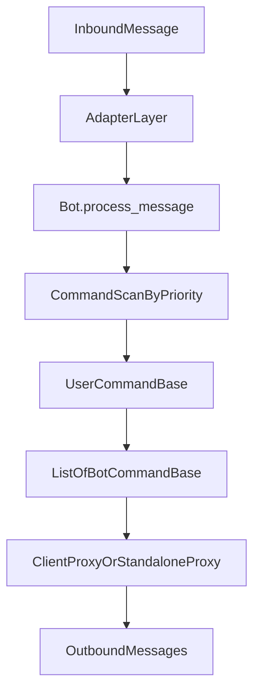

# DicePP 系统总览

本文档描述 DicePP 当前代码结构与运行形态，作为开发文档的入口事实基线。

## 代码边界

项目主代码位于 `src/plugins/DicePP`：

- `core/`：Bot 生命周期、命令分发、配置、本地化、数据层
- `module/`：各功能命令模块（roll、common、initiative、character、query、deck、misc、dice_hub、fastapi）
- `adapter/`：NoneBot / Standalone 适配层
- 根目录 `standalone_bot.py`：Standalone 运行入口

## 两种运行形态

### NoneBot 插件形态

- 由 NoneBot 事件驱动进入适配层
- 通过 `adapter/nonebot_adapter.py` 对接消息并调用 Bot

### Standalone 形态

- 入口：`standalone_bot.py`
- 通过 `module/fastapi/api.py` 暴露 `/dpp` 下 HTTP 接口
- 运行时绑定 `Bot + StandaloneClientProxy`，并在生命周期内完成初始化与关闭

## 核心运行链路

1. 启动时导入 `core.command` 与 `module`，触发命令类装饰器注册。
2. `Bot.register_command()` 从 `USER_COMMAND_CLS_DICT` 读取命令类并按优先级实例化。
3. `Bot.delay_init_command()` 建立数据库连接、执行迁移、运行各命令 `delay_init()`。
4. `Bot.process_message()` 处理消息：预处理 -> 拆分多指令 -> 按优先级遍历命令 -> 收集 `BotCommandBase`。
5. 代理层发送实际输出（群聊/私聊/Standalone 输出缓冲）。

关键代码：

- `core/bot/dicebot.py`
- `core/command/user_cmd.py`
- `module/__init__.py`
- `core/communication/process.py`

## 架构关系图

## 文档阅读路径

- 命令运行机制：`command_runtime.md`
- 命令目录与触发词：`command_catalog.md`
- 数据层说明：`data_layer.md`
- 掷骰引擎：`roll_engine.md`
- Standalone 运行：`standalone_runtime.md`
- 常见开发配方：`dev_recipes.md`
